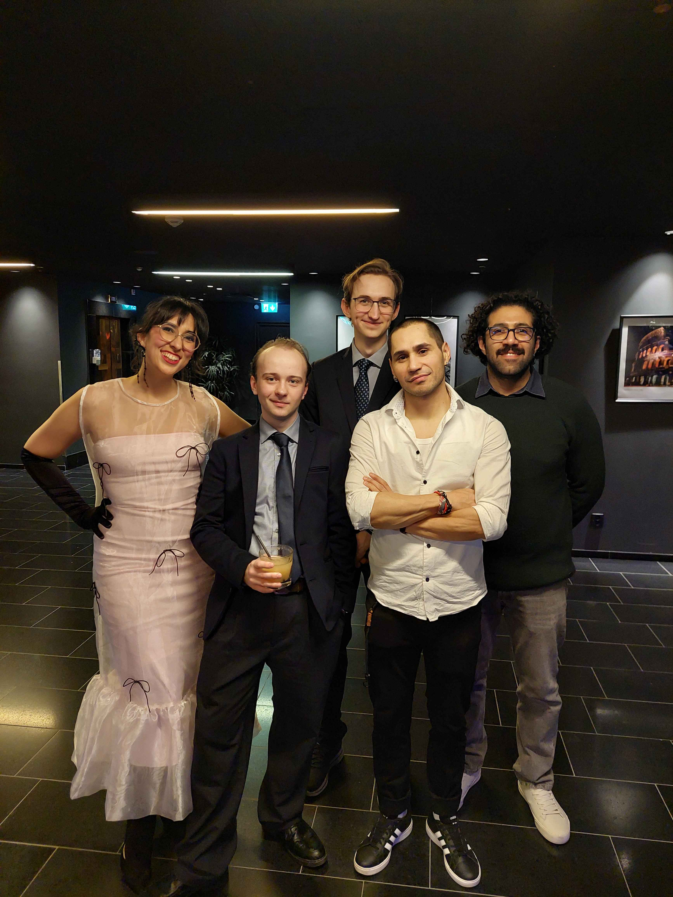

# SUSHI 2 GO!

10 team members • 3 weeks • Unity

**Sushi 2 Go!** is an endless runner taking place entirely on a sushi restaurant conveyor belt. 
Playing as a sushi motivated on escaping, you need to evade and jump over plates, dishes and bottles coming torwards you. If that was'nt hard enough, customers will at their own whim put down and grab plates.

<a href="https://futuregames.itch.io/sushi-2-go" target="_blank">View on itch.io</a>

### Contributions

As the programming lead, I managed tasks, as well as providing mentorship to the junior team members. Being limited in both programming and design resources, I took ownership of the design direction and implementation planning.

**Core Systems**
- Game State 
- Input System
- Event System
- Audio System

**Player Systems**
- Player Movement
- Player Animation
- Player Camera 

**Gameplay Systems**
- Conveyor Belt System 
- Set & Obstacle System
- Set Spawning and Movement
- Design of sets
- Object Pooling

**Polish Systems**
- Procedural turning animation
- Speed & Difficulty Progression
- Time based Scoring
- Menu UI
- In-Game UI
- Enemy Grab/Place System

### Futuregames Awards 2024

In January 2025, the team traveled from Malmö to Stockholm to attend the 2024 Futuregames Awards. The awards are applicable to all students attending Futuregames and have made a game project in 2024.

We were awarded **2nd Place in Animation** and **2nd Place in Art**.

